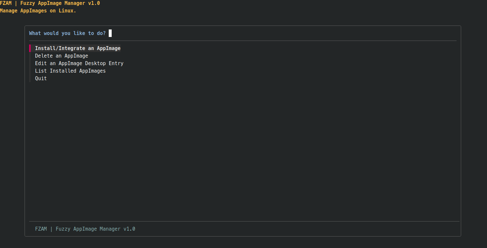

#+TITLE: FZAM | Fuzzy AppImage Manager 

*WARNING: I am not responsible for any AppImage that is integrated to the system using fzam and it is malware. The user is advised to check for the security of the AppImages they download.*

FZAM is a bash script that lets the user integrate their AppImages to their desktop environment easily. It uses [[https://github.com/junegunn/fzf][fzf]] as its interface.

When the user selects an AppImage, fzam extracts the .desktop file from the root of the AppImage, together with its icon (.DirIcon) and make the required changes to the .desktop
file to launch the AppImage and use its icon. 

By default the AppImage, its icon and its desktop entry are moved into predefined locations which the user can change simply by altering some variables in the script.

* Depedencies
- fzf
- xargs
- file
- tree
- gtk-update-icon-cache

* Installation
+ Since fzam installs AppImages on the =~/Applications= folder on the user's home directory, it makes sense that fzam is installed on =~/.local/bin= and exists for the local user only. That means that =make install= should not be run with sudo priviledges.
  #+begin_example
  git clone https://github.com/sat3llite/fzam
  cd fzam
  make install
  #+end_example

+ =make uninstall= will uninstall fzam from the user's system.

* Frequently Asked Questions
** I cannot launch the AppImage through my desktop's menu or it does not show up at all.
Check out these fixes:
+ FZAM changes the arguments in the =Exec== line in the AppImage's .desktop file through pattern matching with sed. So a lot of times this line points to a file that does not exist.
  To fix that simply open the .desktop file of the AppImage (by default the script places it in =~/.local/share/applications=) with a text editor (or through the FZAM menu) and change the Exec line to point to the AppImage location.

  For example for LibreOffice: \\
  Change =Exec=/usr/bin//home/user/Applications/libreoffice.AppImage25.2 %U= (invalid) to =Exec=/home/USER/Applications/libreoffice.AppImage %U= (correct)

+ Some .desktop files contain the line =DBusActivatable=true= which for some reason does not launch the applications. You can set it to false.

+ FZAM saves the .desktop files in =~/.local/share/applications=. But some Linux distributions do not include =~/.local/share= in the =XDG_DATA_DIRS= environment variable so the menu system cannot find it. Edit the =~/.profile= to include this line: 
  #+begin_src bash
  XDG_DATA_DIRS="$HOME/.local/share:$XDG_DATA_DIRS"
  #+end_src

** Fzam uses a wrong name for AppImage.
Simply change the AppImage's filename and its icon filename to the one you want. After that change the .desktop file to point to the right icon and AppImage (in the Icon= and Exec= lines respectively).

** FZAM takes a long time to find my AppImages
This is intentional because for portability reasons I use the system core utilites (find, grep, sed) and not any replacements which are faster (like fd) so that you can use fzam right away on your Linux distribution without needing to install a lot of 3rd party tools.

** The last commit was x months ago
The truth is that fzam is a fairly simple and small project so there is not much that needs to be changed. I call it feature-complete and I do not plan to add new features to it at this moment. It is not unmaintained, just complete.

** Is it vibe-coded?
No I have written every line by myself.

* Features
- Integrate AppImages
- Delete AppImages
- List all installed AppImages

* Features that may or may not be added
- Updating. Not every single AppImage support it ([[https://github.com/AppImageCommunity/AppImageUpdate][AppImageUpdate]] is a solution to this.) 
